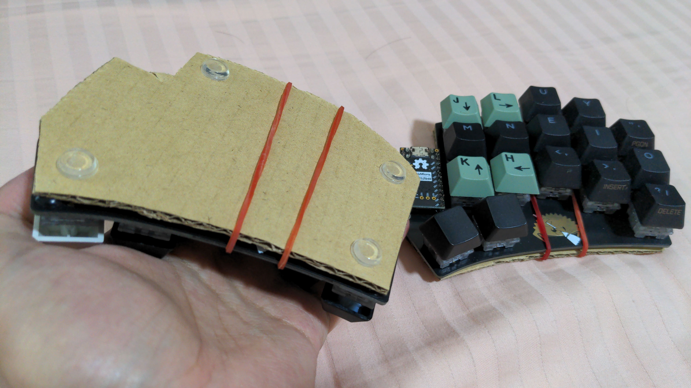

I recently got a Ferris Sweep to get into the r/ErgoMechKeyboards cult, reduce shoulder strain from using a joint keyboard, and reduce finger movement and stretching when typing. I love this thing. I'm typing this very post with the Sweep on my iPad wirelessly!

> **⚠️ WARNING ⚠️**: I am **not** responsible for any readers falling into rabbit holes of building keyboards or modding keymaps without restraint, instead of actually doing typing or work. Ask me how I know. **You have been warned.**

## Specs

This is a Ferris Sweep with MX profile keys, using Akko Crystal Silver switches and the stock Anne Pro 2 keycaps I had unused. It is wireless thanks to a nice!nano clone (SuperMini nRF52840) microcontroller, and runs the ZMK firmware.

## First Impressions

Once I had the keyboard, I started making my own keymap based on some personal preferences and habits I had already known about my keyboard usage. I started with Colemak, and fit all of the numbers and symbols and navigation keys that aren't already covered by the default layer into the 2nd layer I named "num". I then fit modifiers and "text editing" keys on the thumb keys and hold-taps.

While my initial keymap was mostly satisfactory, I did immediately start **noticing issues with my typing habits** that I never noticed on a normal ANSI stagger keyboard. Some of these could be fixed with optimising my keymap to my comforts, but **most of these weren't a keymap issue**.

## Initial Struggles

I had realized that while I was comfortable with typing in the Colemak layout, I was familiar with it on my Anne Pro 2 which had an ANSI stagger. This caused me to **develop very bad finger habits**, including:

1. **Idle finger positions not on home row.** I would idle my left fingers on WASD (or WARS on Colemak) because I was used to that from gaming movements and it was more comfortable than cramping my fingers in a straight row for ASDF (or ARST on Colemak). On the Sweep, it was just natural to idle on home row because of the horizontal "ergo" stagger.
2. **Hitting spacebar with the right index finger.** I thought I was used to hitting spacebar with the left thumb, but it turned out that was only during gaming where the left hand was doing movement and selecting items/skills and the right hand was aiming with the mouse. When I was doing actual typing fast,, I had subconsciously gotten used to using my right index to smash on the spacebar.
3. **Bottom row finger positions offset by 1 column.** The ANSI stagger makes it such that I would hit every key on the bottom row with the wrong finger, but the offset was fixed: I would hit the key to the left of what that finger was supposed to hit. In other words, my fingers were used to the bottom row being moved 1 column to the right. I would hit B with the right index, C with the left index, X with the left middle finger, and Z with the left forth finger. Left pinky solely does Left Shift.

The first issue was naturally resolved after typing for the first day. The whole reason I was interested in a split ergo was to have the rows staggered, so I just needed to follow through on that.

The other 2 issues however, were much harder to get used to, and even now on the 2nd week, I'm still tripping out over these. It's hard to break these natural habits that form because of a bad fundamental layout such as the normal US ANSI layout with the ANSI stagger, especially when I was familiar enough with ANSI to hit 100WPM comfortably (I don't see a point in training myself to be faster than this because I already type faster than my brain can think of what to type out).

For the spacebar, I had tried to add the spacebar to both sides of the thumb cluster, as I originally thought it was a matter of which side's thumb I was using. Until, I added a right thumb spacebar, but it collected dust anyway, and when I went back to typing on an ANSI keyboard like my Anne Pro 2, I noticed the real issue: I was using right index specifically for hitting spacebar when I was typing fast.

I also opted to not take typing lessons or typing tests or things of the sort, and I jumped right into doing actual typing with the new Sweep layout. The reason was simple: I was never going to use over half the words from typing tests and stuff, not when most of my typing involves CLI words  like `git`, `kubectl`, `ssh`, `sops`, `nvim` etc, swear words when I'm chatting with friends, tech words and names like "Kubernetes", "Ceph", "SSD", "NVMe", "Cilium", "VLAN", "WireGuard" etc, internet lingo like "LOL", "LMAO", "idk", and passwords. Oh, and the ZMK keymap itself.

I never got very far with keybr to figure out any of these issues, but within the 2nd and 3rd day of daily driving this keyboard, I had already noticed and outlined the core issue with the bottom row finger positions.

Unfortunately, these issues can't be solved by simply editing the layout. [I tried](https://github.com/JJGadgets/zmk-config/commit/2dff50a8e1ebd1bbbcd272433855cfe12665b32b), but it breaks more than it fixes. So, I had no choice but to resolve myself to re-building the proper habits.

If you find that you're also struggling with bad typing habits that only show on split ergos, **you're not alone**. It's a part of the process. **Keep at it** and you'll find yourself more comfortable with proper typing habits the more you use the split ergo.

## Less Is Actually More

I thought lesser keys was more hassle. I was comfortable with layers, but that was for "non-core" or lesser used keys like media controls, and the Home/End/PageUp/PageDown keys, but putting everything except alphabets behind layers was a whole new level.

However, **lesser keys meant lesser finger movements**, which meant it was actually *more* comfortable to hit the non-alphabet keys without moving my fingers nearly as far. Combined with Colemak, I could feel the results of the reduced finger movement very quickly, and this was combined with the reduced shoulder strain now that I could spread the keyboard out further and avoid cramping up my shoulders to get in a (now not as much) comfortable typing position. More on the shoulders coming up!

## The Bliss of a Wireless Split Ergo

Despite the struggles, I was already **very happy** with using the Sweep in less than 2 days. The reason was simple: **I loved the freedom of having a wireless split ergo keyboard.**

I could place the keyboard wherever I wanted, however I wanted, without needing to cramp my fingers and shoulders up to accomodate the limited positioning of an un-split keyboard, and I could do this with just the device I was going to type on, and the Sweep halves. Nothing more. I could already feel the difference on my shoulders by day 2.

It *has* to be wireless, split, and the ergo key layout, to achieve this level of freedom while retaining hand comfort. Without any one of those, I would not enjoy the keyboard at all.

See, I already have a wired Sweep with Kailh Choc Sunset switches. But, needing 2 cables made it very annoying to use with my laptop at my home desk with the cables running everywhere and restricting my positioning and angling of the halves, let alone use it on a much more portable iPad which I bring around more often than the laptop if I'm out but not at school or work.

However, I had various difficulties converting it to wireless (I have a pair of actual nice!nanos ready and unused), and I wasn't even the one doing the soldering (I have none of the tools or experience). So, I ended up letting that keeb sit around unused for over a year.

(Also, I found QMK a little annoying to work with, and now having used ZMK, it reaffirmed my preference for ZMK over QMK.)

Recently, I finally found a local seller selling preassembled wireless Sweeps using nice!nano clones from SuperMini. I was hesitant at first as I really liked the low profile of the Choc, but after some thinking, and given how just less than a month before that I was revisiting the split ergo scene again, I decided to buy the keyboard anyway despite the MX profile, as I was really feeling the shoulder strain of a normal ANSI more than the last time I used my Choc Sweep.

Within a week, I had used my wireless MX Sweep a lot more than I had used the wired Choc Sweep in the whole period of owning it and having it assembled by a friend.

I don't mind the Choc Sweep collecting dust for a while, because aside from switches, I had picked the absolute cheapest parts for that build, so as long as I can get my switches unsoldered, the rest of the build (including the wired Pro Micros) was less than $30. My MX Sweep looks much cleaner in terms of colors than my Choc Sweep anyway. The nice!nanos I bought and had planned to install in the Choc Sweep, as well as the Choc Sunset switches, will go to a future build, so it's all good.

The main thing was I wanted a wireless split ergo **now**, and I wanted to stop giving myself excuses and procrastinating over it.

## My Layout

My current layout, which can be found on [Git (current commit as of time of writing)](https://github.com/JJGadgets/zmk-config/tree/166d36d1dfb63afb90b64199d4a2f11a2948428d), currently features the following, tailored to my personal preferences and natural flow of thinking and typing:

### Colemak layout
- Comfortable, easy to switch from and with QWERTY in case I use a device I don't own that I can't use my Sweep on, not mod-DH because I couldn't get used to it
### Main 3 layers include default, LNUM and LNAV
- Rest are less important to core typing experience
- LNUM handles left hand numbers, symbols across both, and right side navigation
- LNAV does left hand navigation, right hand Bluetooth, and media controls across both
- Gaming layer has top 2 rows on left half moved to the right by 1 column and remapped to use middle 3 rows for WASD (or WARS on Colemak), right half stays the same
### Bottom row mods
- Home row mods got in my way more often, and this makes the most used home row delay free
### Shared space shift thumb button
- I want space and shift on left half because of familiraity and to free up right hand for mouse use, but it was too annoying to have them separate as I would keep mixing them up and tripping over my left thumb. I am aware this slows me down, but it's more natural and comfortable.
### My layer switching system
- I liked Ben Vallack's idea of having reliable and repeatable mechanisms for layer switching without accidentally pressing unintended keys, but the one thing I didn't like was the lack of layer hold. I find it easier to hold for my LNUM layer and have the release immediately bring me back to the default layer, but sometimes I also like switching entirely to the LNUM layer if I know I need my arrow keys for the next while or I'm typing an IPv4 address.
- After trying a layer hold-tap where pressing will switch to LNUM permanently but holding will only switch to LNUM for the hold duration, and finding that a little rough with misfires, I now use a layer lock, so I can hold to LNUM with the right inner thumb key and lock with the left inner thumb key.
### Layer Lock or TO(0) on other layers is Esc on Tap + Control on hold on Default
- I wanted Control on a thumb key to make Control+[Z|X|C|V] easier, and ESC on a thumb key because of Vim modes, but also wanted my "to layer 0" or "unlock non-default-layer layer lock" key to be harmless if tapped on the default layer 0. What better than to combine all of those as 1 well known key!
### Mod-morphs everywhere
- I use mod-morphs for many things, such as Alt+Tab on default layer (for non-Linux-WM machines like Windows gaming rig), and custom shifted keys like a custom colon key where colon is the unmodded tap and semicolon is the shift tap (easier for both Vim and YAML). It was also nicer to not have everything be time-based such as tap-hold or tap-dance.

## ZMK vs QMK

I personally found ZMK much more flexible and cleaner to use than QMK.

Checking my layout into Git was easier with ZMK thanks to them supporting user config repos compared to QMK needing to fork the whole QMK repo to add your own keymap.

ZMK also allows for much more flexible time-based behavior tuning, such as having the hold-tap tuning be behavior based rather than for the whole keyboard, and generally being more straightforward to tune and understand.

I could get my desired keymap dialed in on ZMK much quicker than in QMK, I never did iron out the time-based tuning on QMK after all, and I have a lot more time-based and mod-based keys on ZMK than QMK, in the way I wanted them configured, because of how easy it is to set them up on ZMK over QMK.

It's also pretty neat that I can use ZMK keyboards in wired USB mode while still using only 1 cable, because the slave half will still connect to the master half using Bluetooth. So even if I have to use a cable, it's still less infuriating than having the TRRS jack coming out the side of the keyboard and blocking certain keyboard positions I prefer to use.

(Oh, and ZMK's USB mode can run at 1000Hz and with eager debouncing (0ms press debounce, 5ms release debounce), making it *technically* possible to game with the wireless Sweep's left half connected over USB. The only issue left for me is ironing out my personal kinds on the GAME layer. It's 17 keys on one half after all.)

For a split ergo setup specifically, I would personally use ZMK over QMK as much as I can.

## Conclusion

If you are also looking to increase typing comfort, while also building much better and more proper typing habits, a wireless split ergo such as the Sweep is definitely worth the investment.

A diodeless single PCB keyboard like the Sweep also makes it more reassuring to bring around everywhere without needing to baby it as much, and takes lesser effort to rebuild.

A 34 key keyboard also forces the user to build better habits over a keyboard with more keys while being cheaper to get into, even if it might occasionally be a hassle to not hve enough keys (e.g. gaming).

**I love my Sweep.** It's been an amazing journey to get into using it full time, and I'm looking forward to fully mastering it and continue its usage.
